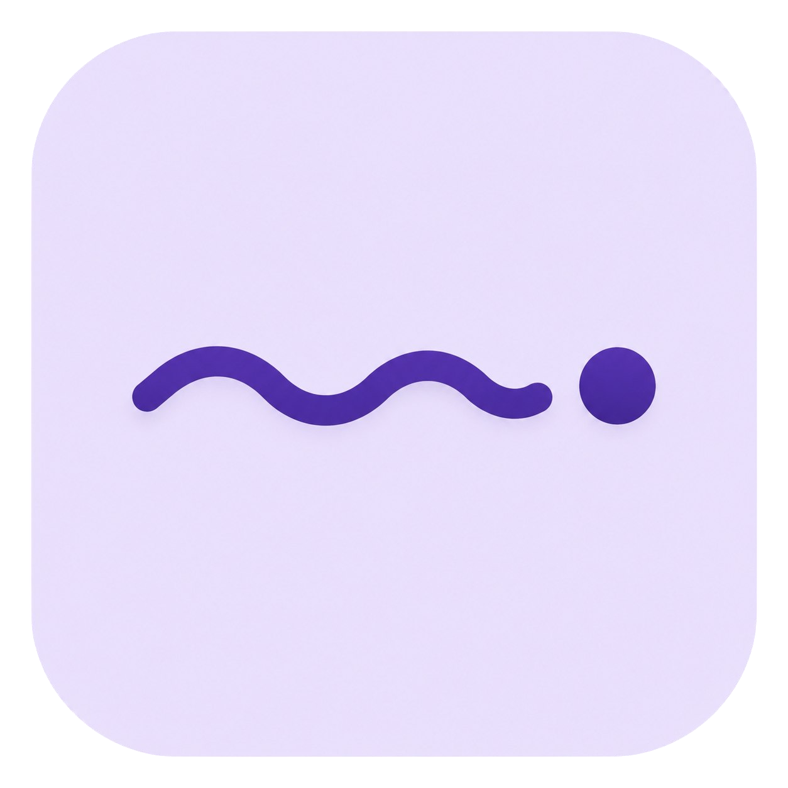
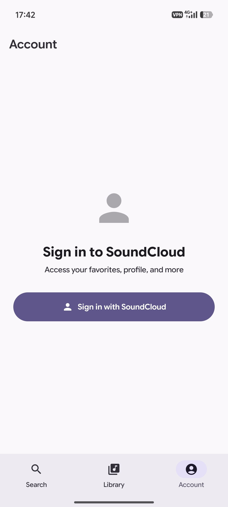
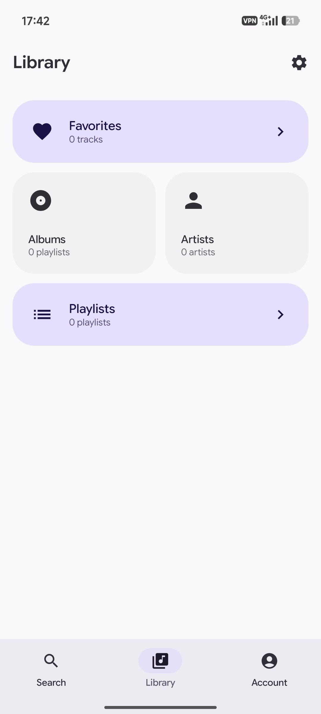
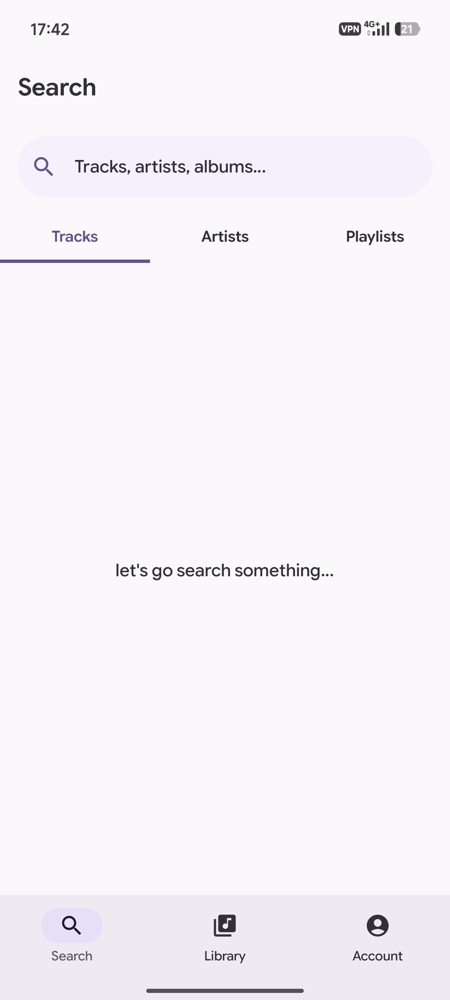

<p align="center">
  
</p>

<h1 align="center">Resona</h1>

<p align="center">
  An open source SoundCloud client for Android.<br>
  No account required.
</p>

<p align="center">
  
  
  
</p>

## Screenshots

<details>
<summary>Show screenshots</summary>

<br>

<p align="center">
  
  
  
</p>

</details>

## Features

- No account required
- Material Expressive interface
- Dynamic colors
- Local favorites
- Offline cache
- Open source

## Build

Debug:

```bash
./gradlew assembleDebug
```

## License

This project is licensed under the GNU General Public License v3.0.
See the `LICENSE` file for details.