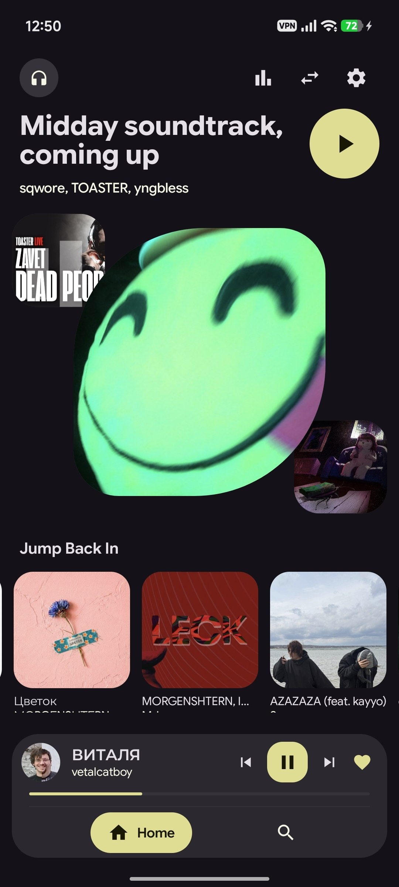
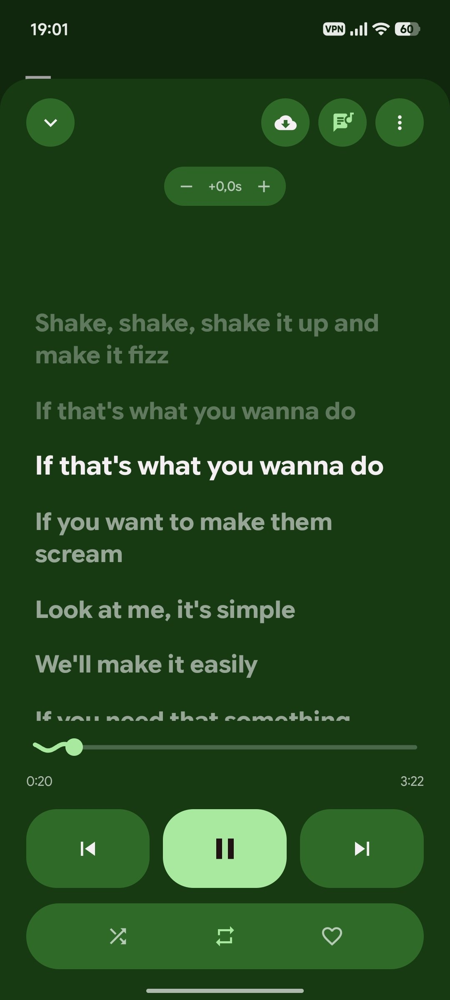
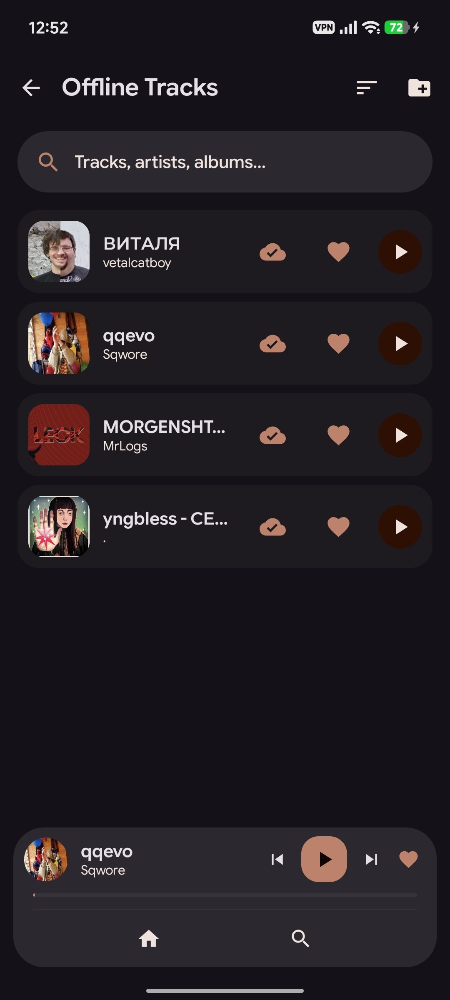
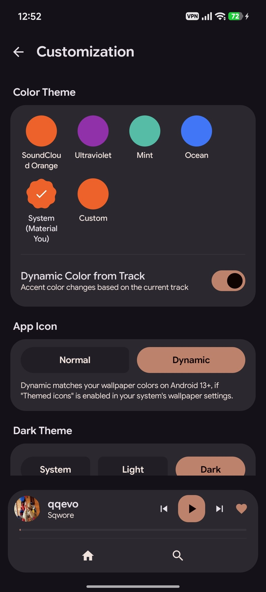

<p align="center">
  
</p>

<h1 align="center">Resona</h1>

<p align="center">
  English · <a href="README.ru.md">Русский</a>
</p>

<p align="center">
  An open source SoundCloud client for Android.<br>
  No ads. No account required.
  <a href="https://keepandroidopen.org" target="_blank" rel="noopener noreferrer">
    Resona supports #KeepAndroidOpen
</a>
</p>

<p align="center">
  
  
  
</p>

## Screenshots

<p align="center">
  
  
  
  
  
</p>

## Install

Grab the latest APK from [GitHub Releases](https://github.com/savo-o/resona/releases/latest). Resona isn't on Google Play, so you'll need to allow installs from your file manager or browser.

You can also track updates automatically with [Obtainium](https://github.com/ImranR98/Obtainium), just point it at this repo.

## Features

- **Open source, no ads, no telemetry.** Nothing to strip out, the whole app is right here
- No account required, log in only if you want to sync your own likes
- Offline downloads, plus a folder watcher that picks up local files automatically
- Import tracks straight from Telegram chats
- Home mix that keeps discovering new stuff from artists you already like
- Lyrics for pretty much anything, even niche tracks, with a few sources chained as fallback and synced timing where it's available
- Crossfade, shuffle and repeat that actually behave
- Favorites and playlists, with multi-select and swipe actions to manage them fast
- Listening stats
- Custom color themes and app icons, dynamic color that adapts to the track's artwork

## Build

Debug:

```bash
./gradlew assembleDebug
```

## Philosophy

Resona will always be free and open source. No subscriptions, no paywalls, no telemetry, no analytics - ever.

## Community

Questions, bugs, ideas: [t.me/resona_tg](https://t.me/resona_tg)

## License

This project is licensed under the GNU General Public License v3.0.
See the `LICENSE` file for details.
