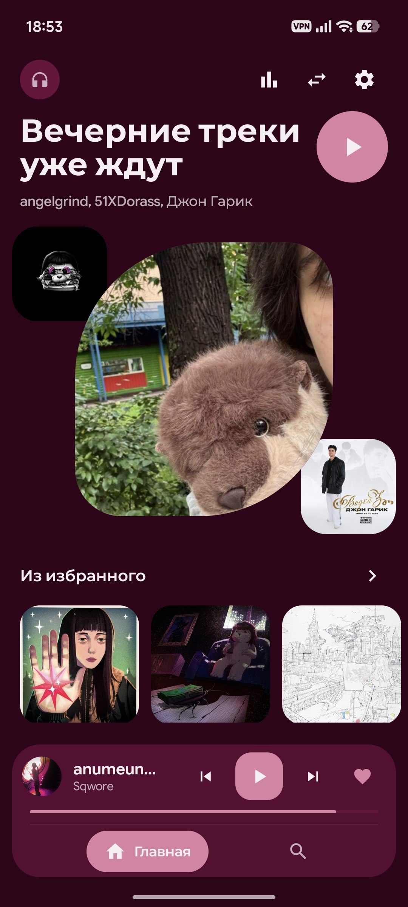
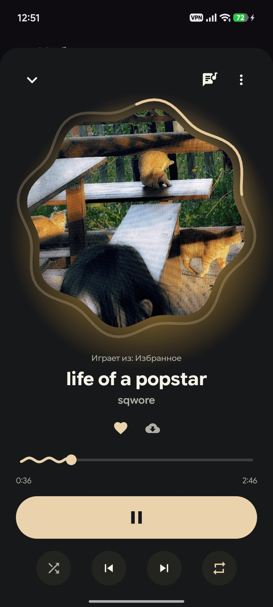
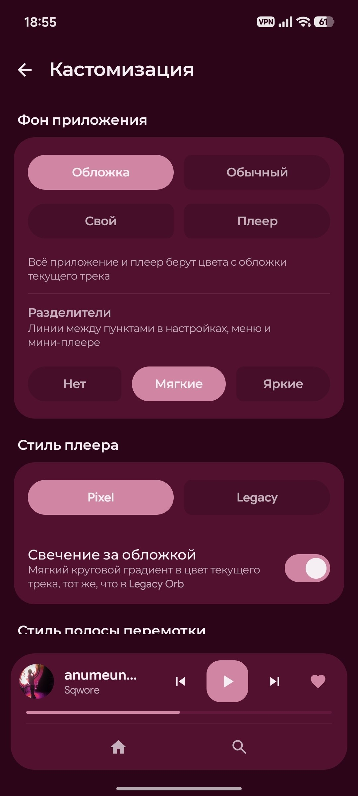

<p align="center">
  
</p>

<h1 align="center">Resona</h1>

<p align="center">
  <a href="README.md">English</a> · Русский
</p>

<p align="center">
  Опенсорсный клиент SoundCloud для Android.<br>
  Без рекламы. Без обязательной регистрации.
  <a href="https://keepandroidopen.org" target="_blank" rel="noopener noreferrer">
    Resona поддерживает #KeepAndroidOpen
</a>
</p>

<p align="center">
  
  
  
</p>

## Скриншоты

<p align="center">
  
  
  
</p>

## Установка

Скачайте последний APK со страницы [GitHub Releases](https://github.com/savo-o/resona/releases/latest). Resona нет в Google Play, поэтому нужно разрешить установку из файлового менеджера или браузера.

Ещё можно следить за обновлениями автоматически через [Obtainium](https://github.com/ImranR98/Obtainium), просто укажите ему этот репозиторий.

## Возможности

- **Открытый исходный код, без рекламы, без телеметрии.** Нечего вырезать, весь код прямо тут
- Регистрация не нужна, войти можно, если хотите синхронизировать свои лайки
- Скачивание для офлайна, плюс слежение за папкой, которое само подхватывает локальные файлы
- Импорт треков прямо из чатов Telegram
- Домашний микс, который постоянно подкидывает новое от артистов, которых вы уже слушаете
- Тексты песен почти для чего угодно, даже для нишевых треков, несколько источников по цепочке как запасной вариант, и синхронный таймкод там, где он есть
- Кроссфейд, перемешивание и повтор, которые реально работают как надо
- Избранное и плейлисты, с мультивыбором и свайпами, чтобы управлять быстро
- Статистика прослушивания
- Свои цветовые темы и иконки приложения, динамический цвет, который подстраивается под обложку трека

## Сборка

Debug:

```bash
./gradlew assembleDebug
```

## Философия

Resona всегда будет бесплатной и с открытым исходным кодом. Никаких подписок, платных стен, телеметрии и аналитики. Никогда.

## Сообщество

Вопросы, баги, идеи: [t.me/resona_tg](https://t.me/resona_tg)

## История Звезд

<a href="https://www.star-history.com/?repos=savo-o%2Fresona&type=date&legend=top-left">
 <picture>
   <source media="(prefers-color-scheme: dark)" srcset="https://api.star-history.com/chart?repos=savo-o/resona&type=date&theme=dark&legend=top-left" />
   <source media="(prefers-color-scheme: light)" srcset="https://api.star-history.com/chart?repos=savo-o/resona&type=date&legend=top-left" />
   
 </picture>
</a>


## Лицензия

Проект распространяется под лицензией GNU General Public License v3.0.
Подробности в файле `LICENSE`.
